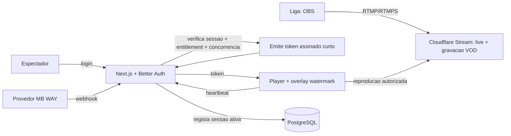

# Arquitetura Técnica — FirstRow

## Fluxo de ponta a ponta

## Componentes
- **Vídeo — Cloudflare Stream.** Ingest RTMP/RTMPS do OBS; grava automaticamente para VOD; entrega com signed URLs/tokens. Custo ~1€/1000 min entregues. Alternativa: Mux.
- **App — Next.js (App Router, RSC-first)** na Vercel. Server Actions para mutações; Route Handlers para webhooks e para os endpoints de vídeo (mint de token, heartbeat).
- **Auth — Better Auth** (donos dos users, UE).
- **Concorrência.** `playback_sessions` + heartbeat: garante 1 sessão ativa por conta.
- **Jobs — Inngest.** Processar VOD no fim da live, sincronizar subscrições, limpar sessões expiradas, emails.
- **Pagamentos.** MB WAY via IfthenPay/Eupago (a confirmar — ver [PAGAMENTOS.md](PAGAMENTOS.md)); webhooks → estado de subscrição.

## Modelo de dados (esboço)
- `tenants` — liga/criador. Multi-tenant; tudo é scoped por `tenant_id`.
- `users`, `memberships(user_id, tenant_id, role)`.
- `tiers(tenant_id, nome, preço, tipo)` — ex.: Acesso Antecipado, Live Stream.
- `subscriptions(user_id, tier_id, status, current_period_end)`.
- `entitlements(user_id, resource)` — o que pode ver (derivado da subscrição).
- `events(tenant_id, data, título)`, `streams(event_id, cloudflare_id, estado)`, `vod_assets(stream_id, cloudflare_id)`.
- `playback_sessions(user_id, resource, started_at, last_heartbeat, active)` — **concorrência**.
- `playback_tokens(user_id, resource, expires_at)`.
- `payments/invoices`, `leak_reports`, `bans`.

## O que é novo vs a stack base
Só **uma peça**: o fornecedor de vídeo (Cloudflare Stream). Todo o resto é a stack do template (ver [../00-GERAL.md](../00-GERAL.md)).
